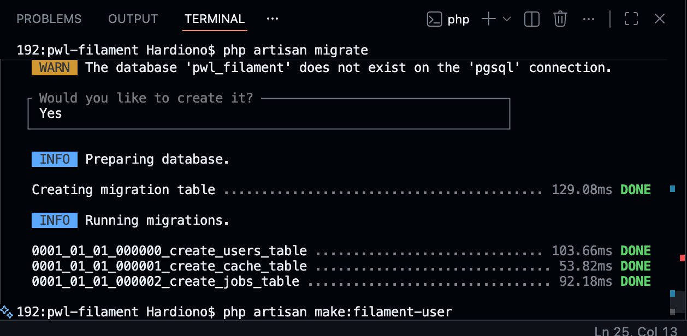
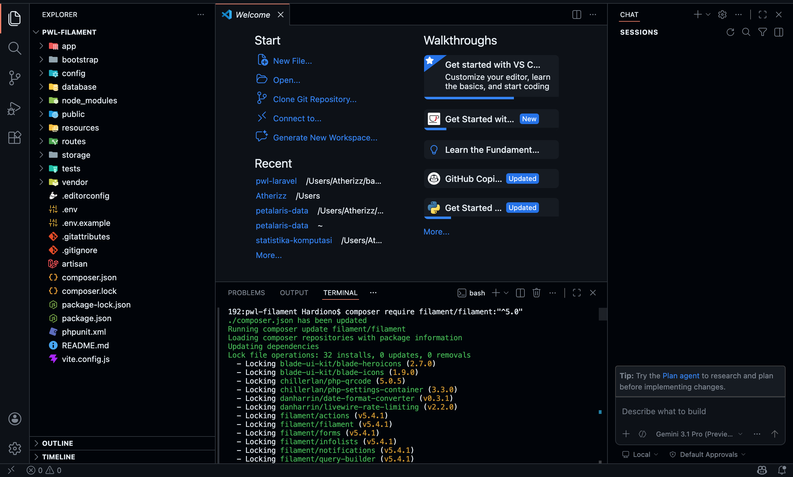
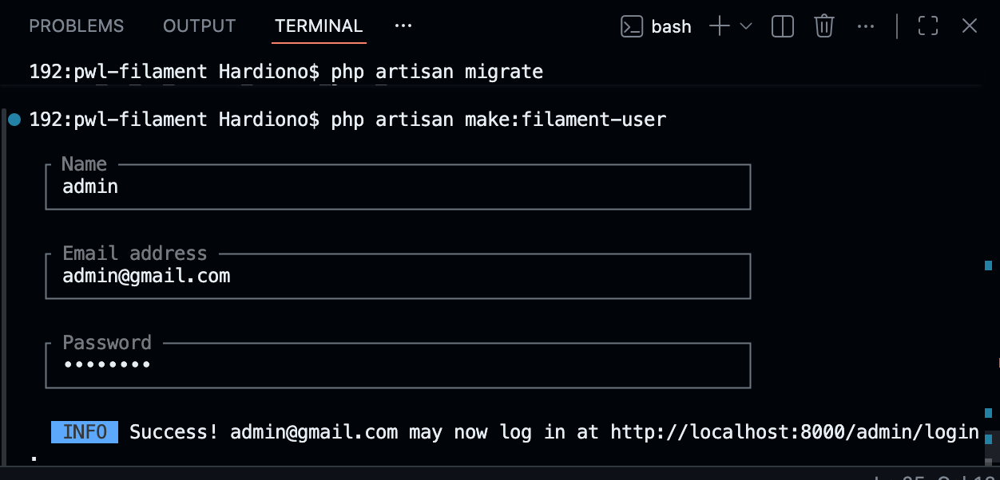

# Laporan Tugas Jobsheet 5.1 - PWL 2025/2026

## Langkah-Langkah Praktikum

**Langkah 1 – Membuat Project Laravel Baru**
```bash
laravel new filament-app
cd filament-app
```

**Langkah 2 – Konfigurasi Database MySQL**
1. Edit konfigurasi database pada file `.env`:
```env
DB_CONNECTION=mysql
DB_HOST=127.0.0.1
DB_PORT=3306
DB_DATABASE=Filament2026
DB_USERNAME=root
DB_PASSWORD=
```
2. Jalankan migrasi database:
```bash
php artisan migrate
```


**Langkah 3 – Install Filament**
1. Install package Filament melalui Composer:
```bash
composer require filament/filament:"^4.0"
```
2. Install Panel Builder:
```bash
php artisan filament:install --panels
```
*(Catatan: Versi Filament yang terinstall pada praktikum adalah versi 5)*


**Langkah 4 – Membuat User Admin**
Membuat user admin baru untuk dashboard Filament dengan perintah:
```bash
php artisan make:filament-user
```
- Email: admin@gmail.com
- Password: (password tersembunyi)



**Langkah 5 – Menjalankan Aplikasi**
Jalankan development server:
```bash
php artisan serve
```
Akses halaman admin di browser melalui URL: `http://localhost:8000/admin`

### Hasil yang Diharapkan
- Bisa masuk ke Dashboard Admin.
- Data user tersimpan di dalam database.


## Pertanyaan
**1. Apa kelebihan Filament dibanding membuat admin panel manual?**
Filament menawarkan kepraktisan (*rapid development*) karena sudah menyediakan berbagai fitur dan komponen UI yang siap pakai (seperti form, tabel, auth, dan widget). Hal ini mempercepat siklus *development*, sehingga pengguna tidak perlu merancang halaman dan logika dari nol.

**2. Mengapa Filament menggunakan Livewire?**
Livewire memungkinkan pembuatan antarmuka pengguna yang dinamis dan interaktif (*SPA-like experience*) secara efisien hanya dengan menggunakan bahasa PHP, tanpa harus selalu bergantung dan berpindah konteks ke framework JavaScript (seperti Vue/React).

**3. Apa perbedaan SQLite dan MySQL dalam development?**
SQLite bersifat file-based (berbasis file lokal), sangat praktis untuk proyek skala kecil atau saat tahap awal dan *testing* karena tidak butuh instalasi/konfigurasi database server terpisah. Sedangkan MySQL adalah RDBMS berbasis *client-server* yang ideal dan efisien untuk proyek skala menengah hingga produksi skala besar yang memiliki beban baca/tulis (*concurrency*) tinggi.

**4. Apa fungsi Panel Builder?**
Panel Builder pada Filament berfungsi sebagai pondasi utama untuk membangun *dashboard* atau admin panel dengan fungsionalitas komprehensif. Fungsinya mencakup manajemen *routing*, struktur menu navigasi, dan pendaftaran halaman lainnya (resource, pages, widget) di dalam satu tempat terpusat yang sudah dilengkapi standar autentikasi.

---

## Kesimpulan
Pada praktikum ini, telah berhasil melakukan instalasi dan konfigurasi awal Filament pada project Laravel, termasuk:
- Mengonfigurasi koneksi database.
- Melakukan instalasi package Filament dan panel builder.
- Membuat akun admin.
- Menjalankan aplikasi untuk mengakses admin panel secara *live*.
