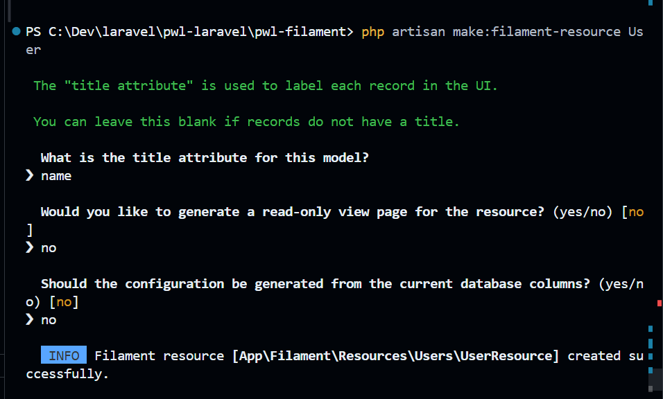
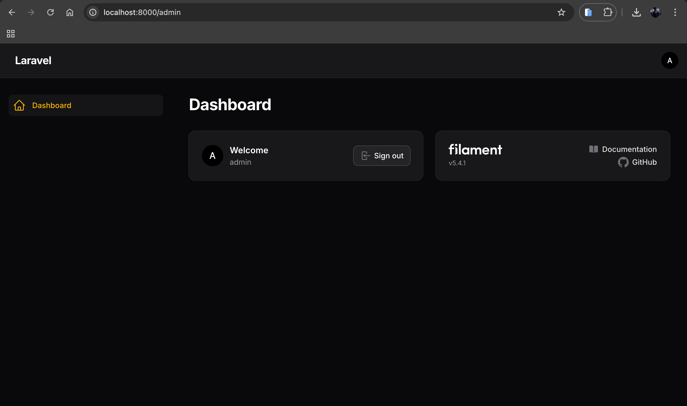
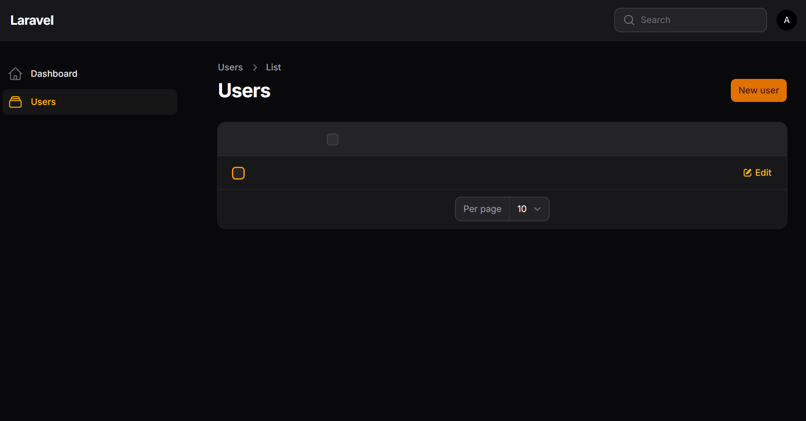
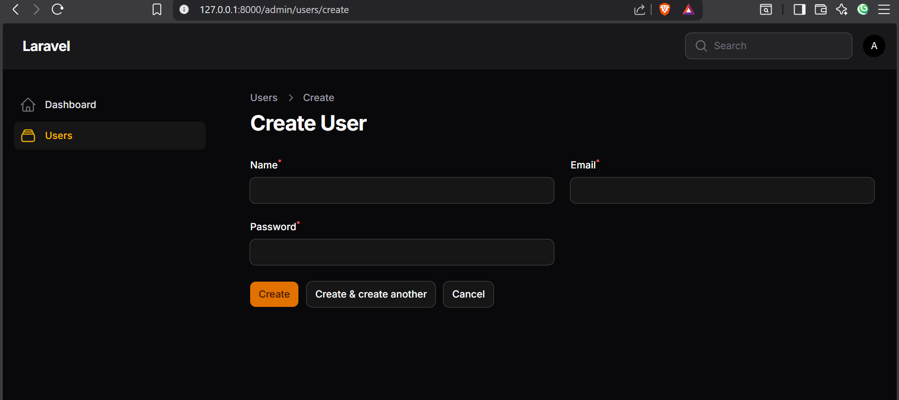
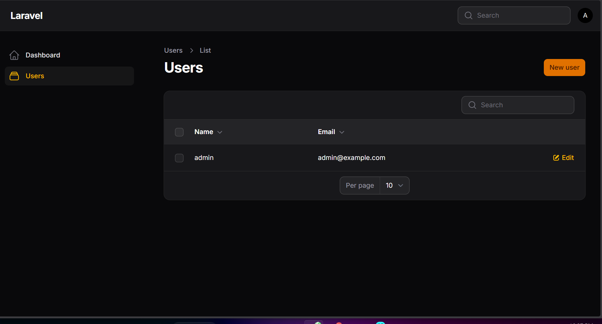
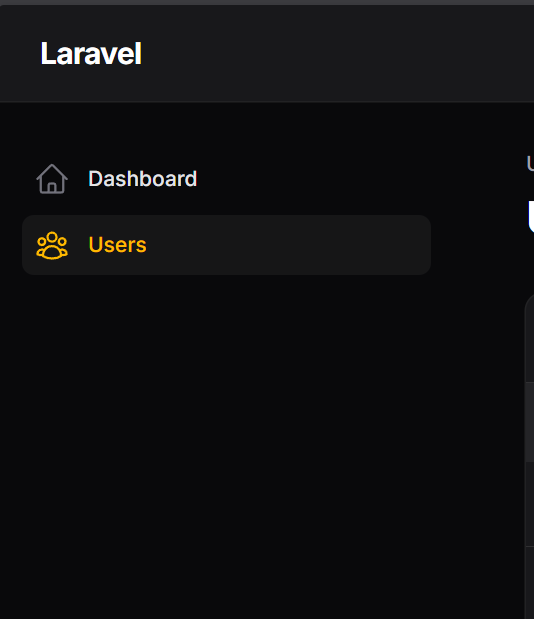

# Laporan Tugas Jobsheet 5.2 - PWL 2025/2026

## Langkah-Langkah Praktikum

**Langkah 1 – Membuat Resource**
Karena Laravel sudah memiliki model User, kita langsung membuat resource dengan perintah:
`ash
php artisan make:filament-resource User
`
Isikan saat diminta:
- Attribute utama → 
ame
- Generate read-only page → No
- Generate dari database → No

Struktur Folder yang Terbentuk
Setelah berhasil, akan muncul beberapa file struktur untuk resource User.

**Langkah 3 – Menjalankan Aplikasi**
`ash
php artisan serve
`
Login ke browser:
http://localhost:8000/admin
Sekarang akan muncul menu **Users** di sidebar.

Jika diklik menu *Users* pada sidebar lalu diklik tombol *New User*, saat ini belum ada form inputnya.

**D. Membuat Form Input (Create & Edit)**
Buka file UserForm.php. 
Modifikasi dan tambahkan field berikut pada form.
Refresh browser.
Hasil:
- Form Create User memiliki input Name, Email, Password.
- Password otomatis terenkripsi oleh Laravel.

Coba diinputkan data dan cek pada DB. Saat kembali ke halaman utama, data tidak dapat ditampilkan.

**E. Menampilkan Data pada Tabel**
Buka file UsersTable.php. 
Tambahkan kolom untuk tabel.
Refresh browser.
Sekarang halaman list menampilkan:
- Nama
- Email
- Tombol Edit
- Tombol Delete

**F. Ilustrasi CRUD Filament**
Seluruh tahap CRUD telah terbentuk secara ilustratif berkat bantuan generator dari resource Filament.

**G. Mengganti Icon Menu Resource**
Filament menggunakan Heroicons sebagai icon default.
Website resmi: Heroicons.
Buka file UserResource.php.

Ubah property icon menjadi:
`php
protected static string|BackedEnum|null $navigationIcon = Heroicon::UserGroup;
`

Refresh browser → Icon berubah.
(Berikut ilusrasi sebelum dan sesudahnya)

---

